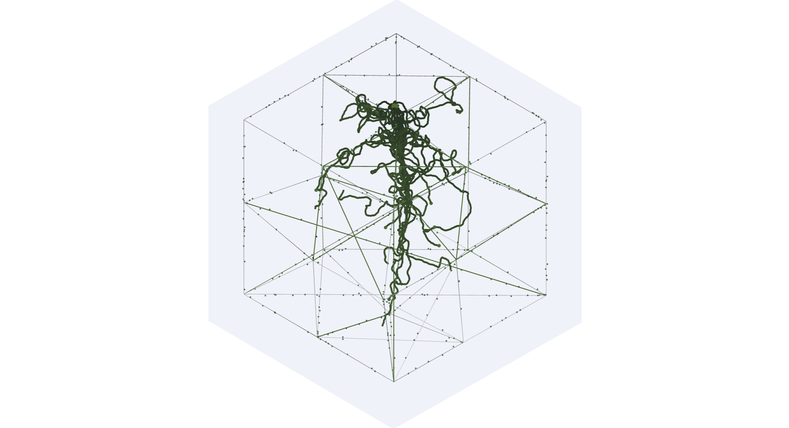

## WETLAND ROOT (L-SYSTEM) AND VORONOI STRUCTURE SIMULATION
visualizes the submerged growth of floating wetland plant roots through an L-system, showing how roots adhere to a surrounding Voronoi cellular lattice where bacterial biofilms form and create the conditions necessary for nitrogen removal. this complementary relationship between organic root growth and an engineered Voronoi structure is explored as part of a project proposal for the Advanced IV Architecture Studio at GSAPP.

### MINIMAL CONTROLS

Click space bar to display biofilm accumulation.
LMB to rotate camera.
RMB to pan camera.

